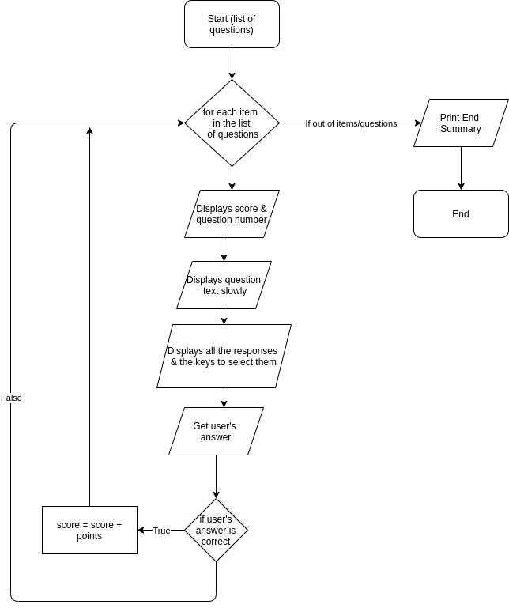

# Software Development Plan

A Command Line Interface quiz game

Created by Sacha Bucinskas for Coder Academy

### Features

* Custom Quiz File Support using JSON
* Local Multiplayer
* Scrollable Menus
* Instanteous input
* Dynamically scales with window size 

## Purpose & Scope

### Description

The terminal application is a fairly simple quiz format, questions are printed before giving the user/s the options below. The user/s is rewarded for correct & timely answers. It supports user made quizes

### Problems it solves

Learning is done best when the individual is well engaged with the activity at hand, and one of the best ways to engage someone is through gamification. This application does so by using the quiz template everyone's familiar with, and adding some more modern video game mechanics. Gamification is also more effective with younger demographics who are more familiar with video game concepts. Not every computer is well equipped whether they have limited display options or simply slow, a simplistic CLI application like this is able to be ran on slow computers, or even on remote computers in SSH sessions, allowing this to be used on computers which don't even have window managers.

### Audience

This application is primarily targeted at the education space, particularly younger age groups who engage with video games more readily than older demographics. The ability to easily add quizes as well as play local multiplayer makes it ideal in Computer Lab environments, as teachers or students can create quizes, and engage with their peers in their tasks. 

## User Experience

Users will be greeted by a Menu allowing them to pick Single Player, Multi Player, or Exit

If they select Single Player they will then have to select which quiz from the pagedMenu

They'll then have the question slowly printed before their answer options are revealed with the relevant keys/controls printed alongside it

If they answer wrong, it will notify them & tell them the correct answer before waiting for any key to display the next question

If they answer correctly, it will notify them & tell them how many points they gained before waiting for any key to display the next question

Once they've answered all the questions, it will display a short summary of how many questions there were, how many they answered correct, their accuracy in % and their score

The Multiplayer experience is very similar, they experience the same quiz selection screen

The question page again is very similar, however it now displays 2 sets of controls & 2 sets of scores at the top

If they answer wrong, it's largely the same except now they also lose points to discourage blocking the other person answering with bad answers

If they answer right, again, largely the same except display 2 scores

The end summary page is tweaked a decent bit. It provides both combined/culmative stats for people playing cooperatively, as well as individual scores for those playing competitively

Hitting exit in the Menu, well, exits immediately

## Flow Diagrams

### Main

### pagedMenu

### SP Quiz

### MP Quiz

