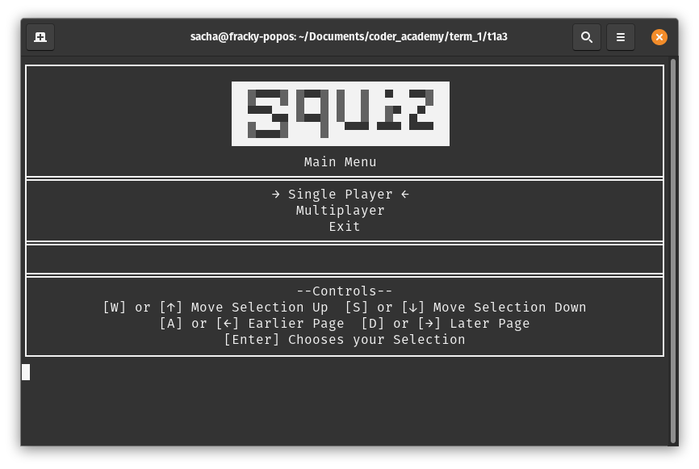
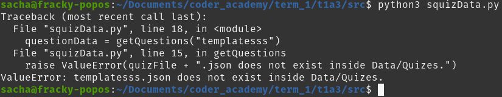
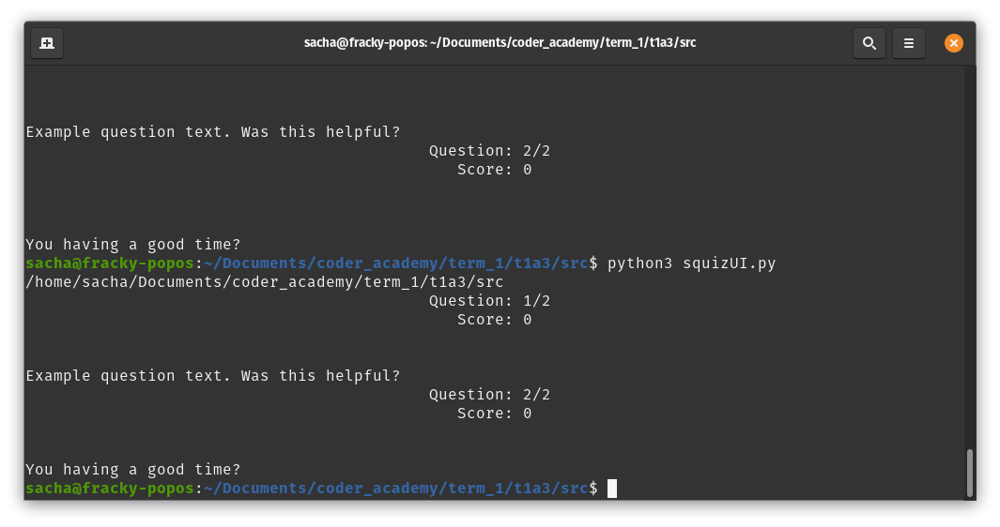
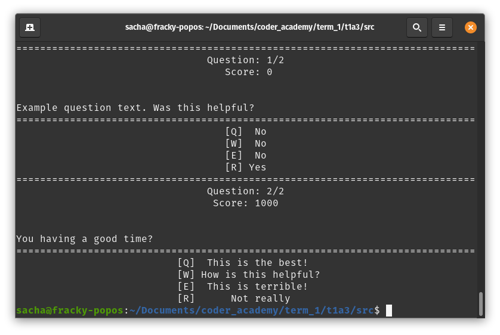
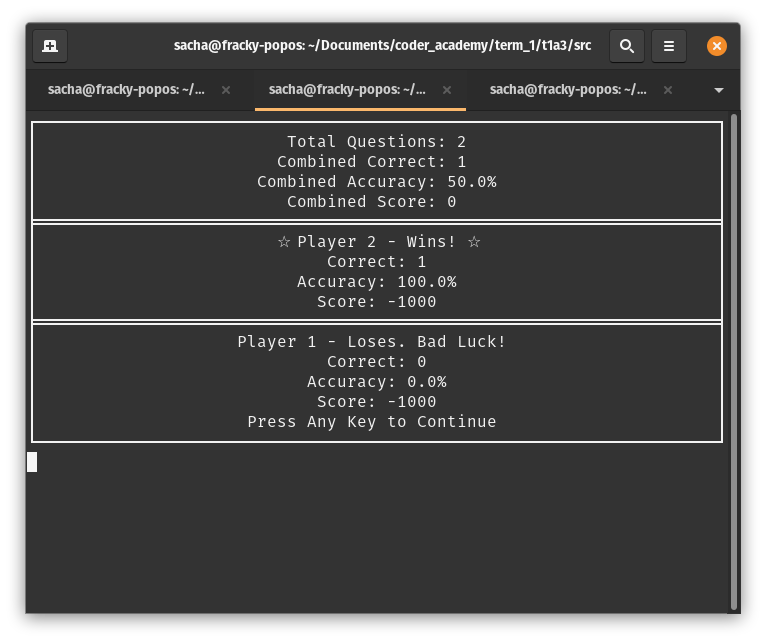
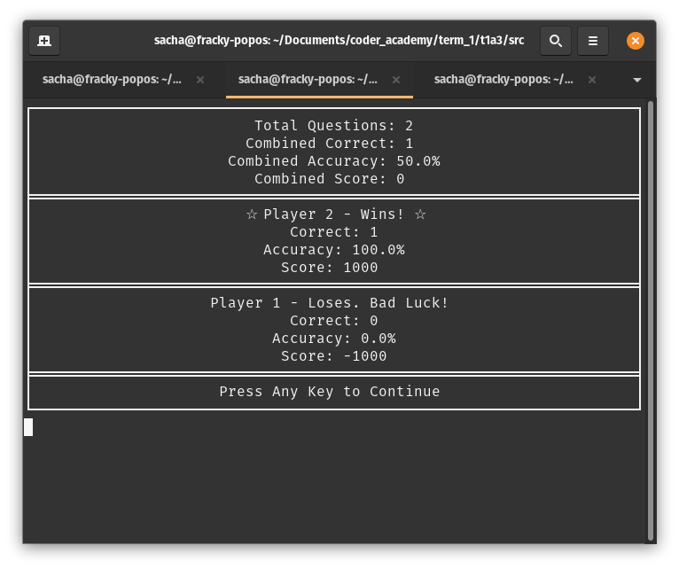

# Tests

# Launch Argument Tests
Test:
Launch script.sh &/or main.py with --help -sp & -mp launch arguments.

Example

    ./script.sh --help

Expected Output

    Found getch
    squiz 1.0 (python3)
    Usage: python main.py [options]

    Squiz is a command line quiz program made in Python 3 supporting custom quiz files & local Multiplayer!

    Available Arguments:
            --help - Prints out this message with help on how to use the program
            -sp - Allows you to choose & play a quiz without going through the main menu or quiz selector
            -mp - Allows you to choose & play a quiz in Multiplayer without going through the main menu or quiz selector

Received Output

The issue was the conditions to prevent the program failing from not providing launch arguments (index out of range error) was not detecting or running the arguments when they were provided. Tweaking this to run whenever there's 2 or more arguments fixed this. Trying & excepting didn't seem to for some reason

# squizData file does not exist test

With the following code:

    import squizData
    squizData.getQuestions("Filename.json")

You'd expect the list of questions from "Filename.json" to be returned, but if the program is trying to open a file that doesn't exist, squizData will raise a valueError like so

Exits the program as it can't do anything else at that point and provides the error in the console which should allow the user to resolve the issue. Should only really come up when using launch arguments to manually specify files, as Squiz should only attempt to open files that exist using the provided menus

# Quiz Display & Input Test

An early screenshot when testing the template.json & the quiz display module

Soon after I began work on displaying the responses/options/answers as well as doing input

# Multiplayer End Summary

In this test, Player 2 won with 1000 points (as shown by their correct answer & the combined score) but it displayed their points as -1000. 

This was due to some copied code where the playerOneScore variable remained in the summary where playerTwoScore should have been
